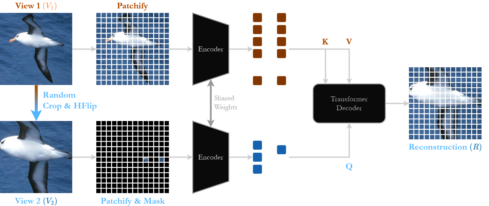

# CropMAE

PyTorch implementation of CropMAE [[`arXiv`](https://arxiv.org/abs/2403.17823)].

<div align="center">
  
</div>

## Citation
If you use our code or find our results helpful, please consider citing our work:
```bibtex
@article{Eymael2024Efficient,
	title = {Efficient Image Pre-Training with Siamese Cropped Masked Autoencoders},
	author = {Eyma{\"e}l, Alexandre and Vandeghen, Renaud and Cioppa, Anthony and Giancola, Silvio and Ghanem, Bernard and Van Droogenbroeck, Marc},
	journal = {arXiv:2403.17823},
	year = {2024},
}
```

## Checkpoints

| Dataset  | $J\\&F_m$          | mIoU | PCK@0.1 | Download |
| -------- | ------------------ | ---- | ------- | -------- |
| ImageNet | 60.4               | 33.3 | 43.6    |  [link](https://drive.google.com/file/d/1RTkARjzkM9S3OO87AzVeDbYAF_b2zA-2/view?usp=sharing)
| K400     | 58.6               | 33.7 | 42.9    |  [link](https://drive.google.com/file/d/1oMXiX_uyGzyQB7S-MYkdJvKFmIuPXkYb/view?usp=sharing)

## Training

### Environment
Create a virtual environment (e.g., using conda or venv) with Python 3.11 and install the dependencies:

```bash
conda create --name CropMAE python=3.11
conda activate CropMAE
python -m pip install -r requirements.txt
```
### Starting the training

This section assumes that you want to run CropMAE with default parameters. You can run `python3 train_cropmae_in.py -h` to have a complete list of possible parameters that you can change.

#### Single GPU
To start the training on a single GPU, you just have to provide the path to your dataset (typically ImageNet):

```bash
python train_cropmae_in.py --data_path=path/to/imagenet/folder
```

#### Multi-GPUs
We provide a script to start the training on a cluster of GPUs using slurm. Modify the `scripts/train_cropmae_in.sh` with the parameters you want to use and start the training with:
```bash
cd scripts && sbatch train_cropmae_in.sh
```

## Evaluation

### Prerequisites
Download the [DAVIS](https://davischallenge.org/), [JHMDB](http://jhmdb.is.tue.mpg.de/), and [VIP](https://github.com/HCPLab-SYSU/ATEN) datasets.

### Perform evaluation
Adapt `downstreams/propagation/start.py` to include the paths to the datasets you have previously downloaded. You may also adjust other parameters related to the evaluation, though the default settings are based on the ones we used. After making these adjustments, simply execute the following command to start the evaluation:

```bash
python3 -m downstreams.propagation.start {name} {epoch} {checkpoint}
```

This will create the folder `downstreams/propagation/{name}_{epoch}` and evaluate the checkpoint `{checkpoint}` for the three downstream tasks. The results will be saved in this folder, printed to standard output, and reported on Weights & Biases if enabled.

## Acknowledgements

Our code is based on the offial [PyTorch implementation of MAE](https://github.com/facebookresearch/mae).  
The evaluation code is based on [videowalk](https://github.com/ajabri/videowalk).