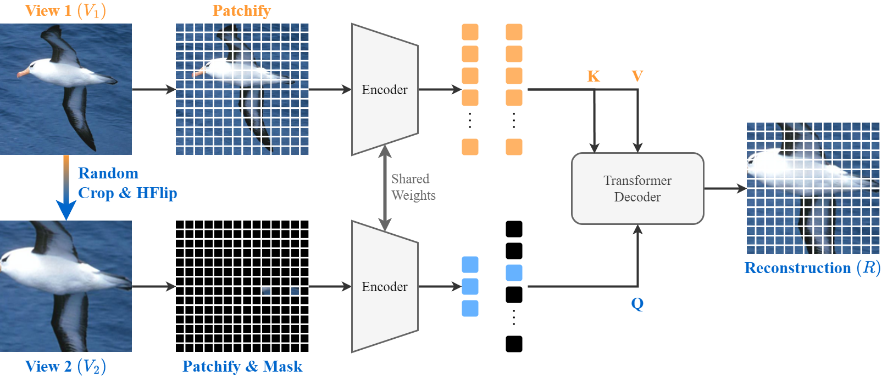

# CropMAE: Efficient Image Pre-Training with Siamese Cropped Masked Autoencoders

[](https://arxiv.org/abs/2403.17823)
[](https://opensource.org/licenses/Apache-2.0)

PyTorch implementation of CropMAE, introduced in [Efficient Image Pre-Training with Siamese Cropped Masked Autoencoders](https://arxiv.org/abs/2403.17823), and presented at ECCV 2024.

<div align="center">
  
</div>

## 🚩 Checkpoints

| Dataset  | $J\\&F_m$          | mIoU | PCK@0.1 | Download |
| -------- | ------------------ | ---- | ------- | -------- |
| ImageNet | 60.1               | 33.2 | 43.5    |  [link](https://drive.google.com/file/d/1Hwxpck0MGBJkPNpXRxMOyydtehhhtZbj/view?usp=sharing)
| K400     | 58.6               | 33.7 | 42.9    |  [link](https://drive.google.com/file/d/1oMXiX_uyGzyQB7S-MYkdJvKFmIuPXkYb/view?usp=sharing)

## 👁️ Visualization Demo

Run an interactive demo of CropMAE in the cloud using [Colab Notebooks](https://colab.research.google.com/drive/173wOiSf0ViXgTd6ARibVn1E6pN_asJKk), or locally with the [Notebook Demo](cropmae_reconstructions.ipynb).

## 🚀 Training

### Environment
Create a virtual environment (e.g., using conda or venv) with Python 3.11 and install the dependencies:

```bash
conda create --name CropMAE python=3.11
conda activate CropMAE
python -m pip install -r requirements.txt
```
### Starting the training

This section assumes that you want to run CropMAE with default parameters. You can run `python3 train_cropmae_in.py -h` to have a complete list of possible parameters that you can change.

#### Single GPU
To start the training on a single GPU, you just have to provide the path to your dataset (typically ImageNet):

```bash
python train_cropmae_in.py --data_path=path/to/imagenet/folder
```

#### Multi-GPUs
We provide a script to start the training on a cluster of GPUs using slurm. Modify the `scripts/train_cropmae_in.sh` with your slurm configuration (e.g., account name) and the parameters you want to use, and start the training with:
```bash
cd scripts && sbatch train_cropmae_in.sh
```

## 📊 Evaluation

### Prerequisites
Download the [DAVIS](https://davischallenge.org/), [JHMDB](http://jhmdb.is.tue.mpg.de/), and [VIP](https://github.com/HCPLab-SYSU/ATEN) datasets.

### Perform evaluation
The `downstreams/propagation/start.py` script can be used to evaluate a checkpoint on the DAVIS, JHMDB, and VIP datasets. Run the following command to have an overview of the available parameters:

```bash
python3 -m downstreams.propagation.start -h
```

For example, to evaluate a checkpoint on the DAVIS dataset with the default evaluation parameters (i.e, the ones used in the paper), you can use the following command:

```bash
python3 -m downstreams.propagation.start --davis --checkpoint=path/to/checkpoint.pt --output_dir=path/to/output_dir --davis_file=path/to/davis_file --davis_path=path/to/davis_path
```

This will create the folder `path/to/output_dir/davis` and evaluate the checkpoint `path/to/checkpoint.pt` on DAVIS. The results, both quantitative and qualitative, will be saved in this folder, printed to the standard output stream, and reported on Weights & Biases if enabled.

## 🖋️ Citation
If you use our code or find our results helpful, please consider citing our work:
```bibtex
@article{Eymael2024Efficient,
	title = {Efficient Image Pre-Training with Siamese Cropped Masked Autoencoders},
	author = {Eyma{\"e}l, Alexandre and Vandeghen, Renaud and Cioppa, Anthony and Giancola, Silvio and Ghanem, Bernard and Van Droogenbroeck, Marc},
	journal = {arXiv:2403.17823},
	year = {2024},
}
```

## 🌟 Acknowledgements

- Our code is based on the official [PyTorch implementation of MAE](https://github.com/facebookresearch/mae).  
- The evaluation code is based on [videowalk](https://github.com/ajabri/videowalk).
